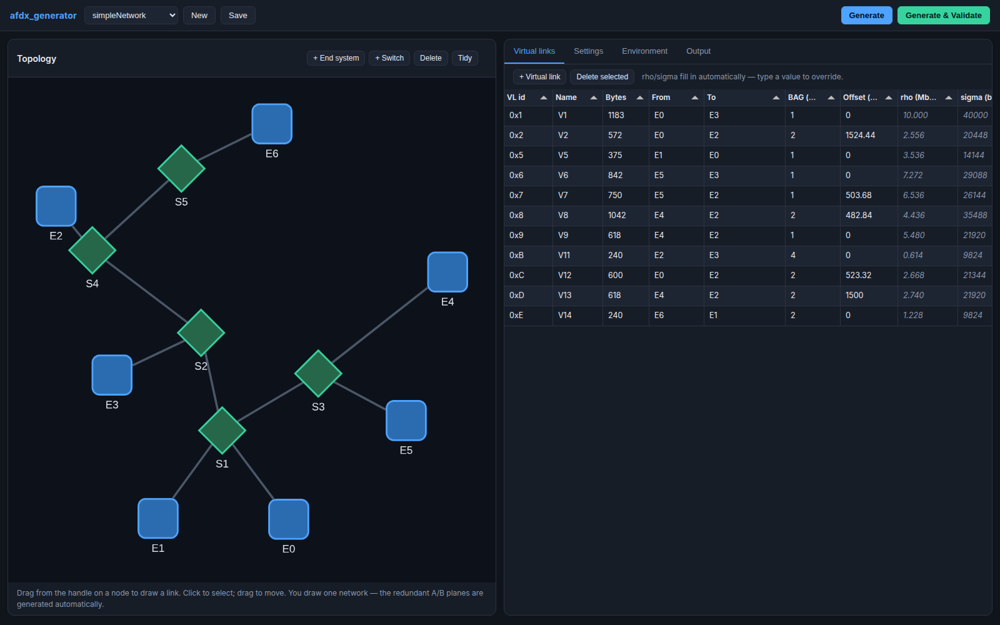

# afdx_generator

Draw an AFDX network, fill in a table of virtual links, get working OMNeT++ files — then run the
real simulator against them to check the result actually behaves.

Built because constructing these networks by hand is mechanical but unforgiving: the routing tables
must list every link that passes through a switch (a missing entry aborts the run), port numbers
must agree between the `.ned` wiring and the routing tables (a mismatch silently misdelivers
frames), and the token-bucket policing parameters have a non-obvious correct value.



> **New here, or not a Python/JavaScript person?** Read
> **[docs/HOW_IT_WORKS.md](docs/HOW_IT_WORKS.md)** — it explains the whole program in plain terms,
> follows your data from a mouse drag to a generated `.ned`, and has a "I want to change X, where do
> I look?" table.

## Running it

```sh
cd afdx_generator
python3 -m venv .venv
.venv/bin/pip install -r requirements.txt
.venv/bin/python -m afdx_generator.main
```

Opens at <http://127.0.0.1:8000/>. Everything runs locally; nothing is fetched from the internet.

## Using it

1. **Topology** — add end systems and switches, drag from a node's handle to draw a link. You draw
   *one* network; the redundant A/B planes AFDX requires are generated automatically.
2. **Virtual links** — one row per traffic stream: payload size, source, destination(s), BAG,
   offset. `rho`/`sigma` fill in automatically; type over either to override.
   Several destinations on one link means multicast.
3. **Settings** — network-wide defaults. Two carry warnings; read them.
4. **Environment** — paths to your compiled simulator and the AFDX libraries. Needed only for
   validation. Stored outside the project file, so projects stay portable between machines.
5. **Generate** writes the files. **Generate & Validate** also runs the simulator and reports what
   it found.

Generated networks land in `output/<network name>/`: a `.ned`, a `.ini`, and one routing table per
switch.

## What it works out for you

| Inferred | From |
|---|---|
| Switch port counts | how many links touch that switch |
| Per-end-system stream counts | how many virtual links it sources |
| Port numbers | a single canonical link ordering, shared by the `.ned` and the routing tables |
| Routing tables | each link's resolved path, including switches it only passes through |
| `rho` / `sigma` | payload size, BAG, and the sigma margin |
| Redundant B plane | mirrored from the topology you drew |

Routing defaults to the shortest path but is **overridable per link** — fewest hops is not always
lowest latency once several links share a congested port, and the tool should not overrule that
judgement.

## Two numbers worth understanding

**`sigma` margin (default 4.0).** The textbook AFDX burst allowance is exactly one maximum frame
(`sigma = Lmax`). That does not work: measured on a real 5-switch network it dropped roughly 90% of
frames from the second hop onward. Policing happens at *every* hop, and traffic from other links
sharing a port perturbs a link's spacing along the way, so a one-frame allowance underruns. 4.0 was
the smallest margin that ran clean there — it is a property of that topology, not a universal
constant. If validation reports dropped frames, raise it.

**Technological latencies (default 50 µs).** The defaults are conventional placeholders, *not*
derived from any published model, and simulated latency is sensitive to them — so set them to
whatever your reference assumes before quoting absolute figures. For the realistic-avionics
literature that means 40 µs per end system and 140 µs per switch; with those, this tool's output
lands inside the published bounds (see below).

## When the AFDX library changes

It is unversioned and can change underneath you. Everything borrowed from it — type names, gate
names, parameter names, the routing-table format — lives in `afdx_generator/libraryprofile/`.

Read `libraryprofile/README.md` first: that file isolates **renames**, not **restructures**.
Renaming `ethPortA` is a one-line edit there; adding a third redundancy plane means editing the
templates in `codegen/templates/`. The README spells out which is which.

## Layout

```
afdx_generator/
  models/          the saved document: topology, virtual links, settings
  domain/          graph adjacency, validation, NED-safe naming
  routing/         path resolution and port numbering
  trafficmath/     rho/sigma sizing
  libraryprofile/  >>> every AFDX-library-specific name lives here <<<
  codegen/         A/B mirroring, context assembly, Jinja templates
  validation/      build the command, run it, interpret the output
  api/             REST endpoints
static/            frontend; vendored libraries, no build step
tests/             72 tests, no OMNeT++ required
```

The pipeline is a chain of pure functions — validate → resolve routes → number ports → size traffic
→ assemble → render — with filesystem access only in the final step. Nothing before
`codegen/context.py` knows any AFDX-specific name.

## Tests

```sh
.venv/bin/python -m pytest
```

Runs without OMNeT++ installed: the simulator is stubbed with a fake binary, and code generation is
checked against a golden fixture — a hand-built 7-end-system / 5-switch / 11-virtual-link network
that was verified against the real simulator. If the generator reproduces its routing tables and
traffic parameters, the pipeline is correct.

Verified end to end against the real toolchain: the reference network was rebuilt through the API,
generated, and run — zero dropped frames, zero errors. A deliberately bad configuration
(`sigma` margin 1.0) was also run, and validation correctly caught it.

## Does it produce a faithful model?

The `realisticNetwork` project reproduces a published 30-link avionics message set. Using that
source's own constants, **28 of its 30 links land inside the published worst-case delay bounds**
(0.69–1.02× of them); the two that don't are sporadic links the published analysis explicitly does
not cover. See [docs/validation_vs_published.md](docs/validation_vs_published.md).

## Known limits

- Both redundancy planes are mirrors of one topology; an intentionally asymmetric A/B network
  cannot be expressed.
- Explicit route overrides apply to single-destination links only — with several destinations
  there is no unambiguous way to read a flat edge list.
- Projects are JSON files with no locking; two browser tabs editing one project will overwrite
  each other.
- `phy_overhead_bits` (160) is hard-coded in the AFDX library's C++ with no way to read it at
  generation time. If that constant ever changes, nothing here will notice.
