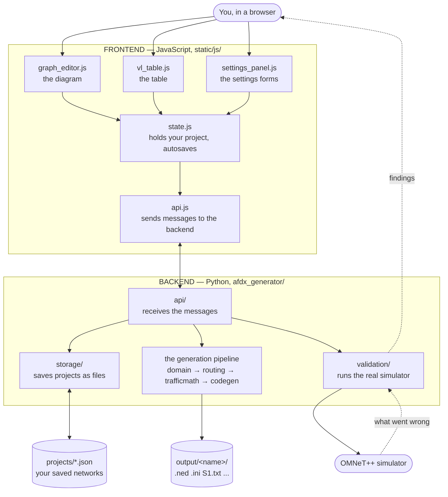
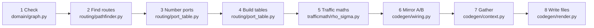

# How afdx_generator works

A guide for someone who knows AFDX and OMNeT++ well, but does not write Python or JavaScript.

Nothing here assumes you can read the code. The goal is that you always know **which file to open**
when you want to change something, and roughly **what shape the change is**.

---

## 1. What the program actually does

You describe a network twice, in two very different languages:

- **The way you think about it:** "seven end systems, five switches, this box talks to that box,
  this message is 1183 bytes every millisecond."
- **The way OMNeT++ needs it:** a `.ned` file declaring modules and wiring, an `.ini` file assigning
  hundreds of parameters, and a routing table per switch listing which port each virtual link leaves by.

The program's whole job is the translation between those two. You do the first; it does the second,
then runs the simulator to check the result actually behaves.

---

## 2. The software stack, in plain terms

Three pieces, each doing one job.

| Piece | What it is | What it does here |
|---|---|---|
| **Python** | A programming language, good at logic and text | All the thinking: routing, maths, writing the OMNeT++ files |
| **FastAPI** | A Python library that answers web requests | The bridge between the browser and the Python code |
| **JavaScript** | The language browsers speak | The screen you look at: the diagram, the table, the buttons |

Two helper libraries do work I did not want to write from scratch:

| Library | Job |
|---|---|
| **Cytoscape.js** | Draws the network diagram and handles dragging |
| **Tabulator** | Draws the spreadsheet-like virtual link table |

Both are stored in `static/vendor/` as ordinary files. Nothing is downloaded while the program runs,
so it works with no internet.

**Why a browser at all?** Drawing a network diagram with a mouse is something browsers are very good
at, and it means no installation — you open a web address. The program is *not* on the internet; it
runs on your machine and only your machine can reach it.

### The one structural idea worth knowing

The program is split in half:

- **Backend** (Python) — everything that must be *correct*. Routing, maths, file generation.
- **Frontend** (JavaScript) — everything that must be *pleasant*. Clicking, dragging, typing.

They talk over a small set of messages. The frontend never decides anything important; it collects
what you did and asks the backend. That is why the whole pipeline can be tested without a browser.

---

## 3. The big picture



---

## 4. Where everything lives

```
afdx_generator/
├── afdx_generator/          ← THE BACKEND (Python)
│   ├── models/              What a project IS (the vocabulary)
│   ├── domain/              Checking the network makes sense
│   ├── routing/             Working out paths and port numbers
│   ├── trafficmath/         The rho/sigma maths
│   ├── libraryprofile/      ★ Every AFDX-library name lives here
│   ├── codegen/             Writing the OMNeT++ files
│   ├── validation/          Running the simulator, reading its output
│   ├── storage/             Saving and loading projects
│   ├── api/                 The doorway the browser talks to
│   └── app.py, main.py      Starting the program
│
├── static/js/               ← THE FRONTEND (JavaScript)
├── static/css/app.css       ← All colours and layout
├── static/vendor/           ← The two helper libraries
├── templates_html/index.html ← The page skeleton
│
├── projects/                ← Your saved networks (JSON files)
├── output/                  ← Generated OMNeT++ files
├── env.json                 ← Paths to your simulator (this machine only)
└── tests/                   ← Automated checks
```

**File-extension cheat sheet:** `.py` = Python (backend). `.js` = JavaScript (frontend).
`.j2` = a *template* — a fill-in-the-blanks skeleton of an OMNeT++ file. `.json` = saved data.
`.css` = appearance.

---

## 5. Following your data, end to end

### Step 1 — You drag a node

`static/js/graph_editor.js` notices, and updates the project held in memory by
`static/js/state.js`. Nothing has been saved yet.

### Step 2 — Autosave

`state.js` waits **2 seconds** after your last change, then sends the whole project to the
backend. (The wait is why dragging a node doesn't cause hundreds of saves.) The indicator top-right
shows *Unsaved changes → Saving… → Saved*.

If you close the tab with a save still pending, it is sent anyway using a `keepalive` request,
which — unlike a normal one — is allowed to outlive the page.

**Undo.** Every change also pushes the previous state onto a small history, so **Undo** in the
toolbar (or Ctrl+Z) steps back through the last **3** changes. It works for anything: topology,
virtual links, settings. An undo saves immediately rather than waiting, so what you see is what is
on disk. The history is cleared when you switch projects, and there is no redo.

The message goes out through `static/js/api.js`, the only file that talks to the backend.

### Step 3 — The backend receives it

`afdx_generator/api/projects.py` receives it and checks every value is sensible — a BAG must be a
positive number, a virtual link id must be valid hex within AFDX's 16-bit range, and so on. This
checking is automatic: it comes from the definitions in `models/`. **If a value is rejected, it is
never stored**, and the save indicator turns red.

### Step 4 — Stored as a file

`afdx_generator/storage/project_store.py` writes it to `projects/<id>.json`. That file *is* your
project — copy it, back it up, email it. It is human-readable:

```json
{
  "name": "simpleNetwork",
  "nodes":  [ { "id": "es0", "kind": "end_system", "label": "E0", "x": -120, "y": 0 } ],
  "edges":  [ { "id": "e01", "node_a_id": "es0", "node_b_id": "sw1", "length_m": 10.0 } ],
  "virtual_links": [
    { "hex_vl_id": "0x1", "frame_bytes": 1183, "source_node_id": "es0",
      "destination_node_ids": ["es3"], "bag_s": 0.001, "offset_s": 0.0 }
  ],
  "general_settings": { "sigma_margin_factor": 4.0, "...": "..." }
}
```

Note it is saved by writing to a temporary file first and then swapping it in — so a crash
mid-save can never leave you with a half-written project.

> Two things are deliberately **not** in this file: the paths to your simulator (they live in
> `env.json`, because they are specific to this computer and would be wrong on anyone else's), and
> the generated OMNeT++ files (they can always be regenerated).

### Step 5 — You press Generate

Now the interesting part. The request lands in `afdx_generator/api/generate.py`, which runs a
**pipeline** — a chain of stages, each taking the previous stage's result:



**1. Check it makes sense** — `domain/graph.py`. Is everything connected? Does an end system have
exactly one cable? Does a virtual link point at a node you deleted? If anything fails you get a
plain-English list and nothing is written.

**2. Find each link's route** — `routing/pathfinder.py`. By default the fewest-hops path. If you
pinned an explicit route, it uses yours and only checks it is a genuine connected path.

**3. Number the ports** — `routing/port_table.py`. Each switch's cables are put in a fixed order;
a cable's position in that list *is* its port number.

> **This is the single most important idea in the program.** The port number appears in two places:
> the wiring in the `.ned`, and the routing table `.txt`. If they ever disagreed, frames would be
> delivered to the wrong place and the simulation would still *run* — a silent wrong answer, far
> worse than a crash. They cannot disagree because both are generated from this one list.

**4. Build each switch's table** — walk every route; at each switch record which port that link
leaves by. This automatically includes links that only *pass through* a switch, which is essential:
the AFDX library aborts the run if a frame arrives for a link the switch has no entry for.

**5. Work out rho and sigma** — `trafficmath/rho_sigma.py`. See §7.

**6. Mirror into two planes** — `codegen/wiring.py`. You drew one network; AFDX needs two identical
ones (A and B). This duplicates it: each end system's `ethPortA` goes to plane A, `ethPortB` to
plane B.

**7. Gather everything** — `codegen/context.py`. The one place where "node", "link" and "route"
become `EndSystem`, `Cable` and `virtualLinkId`. Everything before this point is AFDX-agnostic.

**8. Write the files** — `codegen/render.py` fills in the three templates and writes them to
`output/<network name>/`.

### Step 6 — The templates

A template is the OMNeT++ file you want, with blanks. `codegen/templates/network.ned.j2` contains
lines like:

```
{{ conn.a.module_ref }}.{{ conn.a.gate }} <--> {{ profile.ned.cable }} <--> ...
```

Anything in `{{ }}` is a blank filled at generation time, producing:

```
ES[0].ethPortA <--> afdx.Cable <--> SwitchA[0].ethPort[0]; // E0 - S1
```

**If you want the generated files to look different — different comments, ordering, layout — the
templates are the place, and you can read them without knowing Python.** They look like the output.

### Step 7 — You press Generate & Validate

Same as above, then `validation/` actually runs the simulator:

- `command_builder.py` assembles the command, including the library paths OMNeT++ needs (the fiddly
  part of running it outside the IDE).
- `runner.py` runs it and captures the output.
- `parser.py` reads that output looking for `TOKEN_INSUFFICIENT` (policer dropped a frame),
  `Key Not Found in VL Table` (missing routing entry), queue overflows, and errors. It groups
  repeats — 900 identical drops become one finding saying "×900" — and attaches a suggested fix.

It deliberately **ignores** two things that look alarming but are normal: `undisposed object`
messages (the library prints these on every healthy run) and "simulation time limit reached" (that
is how a bounded run is *supposed* to end).

---

## 6. "I want to change X — where do I look?"

| I want to… | Open this | What it looks like |
|---|---|---|
| **Change a default value** (sigma margin, delays, link rate, header size) | `afdx_generator/models/settings.py` | `sigma_margin_factor: float = 4.0` — change the number |
| **Change how the generated `.ned` looks** | `codegen/templates/network.ned.j2` | Looks like a `.ned` file with blanks |
| **Change how the generated `.ini` looks** | `codegen/templates/omnetpp.ini.j2` | Looks like an `.ini` file with blanks |
| **Change the routing table format** | `codegen/templates/route_table.txt.j2` | Looks like a route table |
| **The AFDX library renamed something** | `libraryprofile/profile.py` | A list of names; change the string. Read that folder's README first |
| **Change the rho/sigma formula** | `trafficmath/rho_sigma.py` **and** `static/js/vl_table.js` | ⚠️ Two places — see the warning below |
| **Add another arrival pattern** (e.g. exponential) | `models/virtual_link.py` (the `ArrivalPattern` list), `codegen/context.py` (build the expression), `static/js/vl_table.js` (the dropdown) | See §7b |
| **Change routing** (e.g. prefer least-loaded over fewest-hops) | `routing/pathfinder.py` | |
| **Add or relax a validation rule** | `domain/graph.py` | Each check adds a sentence to a list |
| **Detect a new simulator error** | `validation/parser.py` | Add a pattern and the hint to show |
| **Add a column to the table** | `static/js/vl_table.js` | A list of column definitions |
| **Add a field to a virtual link** | `models/virtual_link.py`, then `vl_table.js` | Backend first, then the column |
| **Change colours / sizes / layout** | `static/css/app.css` | Colour variables at the top |
| **Change the wording on screen** | `templates_html/index.html` | Ordinary text |
| **Change how the diagram behaves** | `static/js/graph_editor.js` | |
| **Change how often it autosaves** | `static/js/state.js` | `SAVE_DELAY_MS` at the top |
| **Change how many undo steps are kept** | `static/js/state.js` | `MAX_UNDO` at the top |
| **Change where files are written** | `storage/paths.py` | |

> ⚠️ **The one duplicated piece of logic.** The rho/sigma formula exists twice: in Python
> (`trafficmath/rho_sigma.py`, which produces the real values) and in JavaScript
> (`static/js/vl_table.js`, so the table updates instantly as you type). **If you change the
> formula, change both**, or the preview will disagree with what is generated. The *constants* are
> not duplicated — the browser fetches those from the backend — but the arithmetic is.
> This is the only such duplication in the program.

### After changing something

```sh
.venv/bin/python -m pytest        # ~1 second, checks nothing broke
```

- Changed **JavaScript, CSS or HTML**? Just refresh the browser (Ctrl+R). Asset URLs are stamped
  with each file's modification time, so the browser cannot serve you a stale cached copy.
- Changed **Python**? Stop the program (Ctrl+C) and start it again.
- Changed something risky? Press **Generate & Validate** — the simulator is the real judge.

The tests include a stored copy of the hand-built reference network. If a change accidentally alters
the generated routing tables, a test fails immediately and tells you which switch.

---

## 7. Two numbers worth understanding

### sigma (the token bucket burst allowance)

Every switch port polices each virtual link against a token bucket. Textbook AFDX says the burst
allowance should be exactly one maximum frame, `sigma = Lmax`.

**That does not work**, and this was measured, not guessed: with `sigma = Lmax` the reference
network dropped roughly 90% of frames from the second switch onward. The reason is that policing
happens at *every hop*, and between hops a link shares a port with other links, which nudges its
frames out of perfect periodicity. With an allowance of exactly one frame there is no slack for
that, so the bucket runs dry.

The program therefore uses `sigma = margin × Lmax` with the margin defaulting to **4.0** — the
smallest value that ran clean on that network. **It is a property of that topology, not a universal
constant.** A busier network may need more. If validation reports dropped frames, raise it in
Settings.

### The technological delays

`switchFabric.delay`, `latencyTechTx`, `latencyTechRx` are the fixed per-hop costs, and simulated
end-to-end latency is quite sensitive to them.

The built-in defaults (50 µs each) are conventional placeholders, **not** derived from any
published model — they came from an existing example project. If you are comparing against
published figures, set them to whatever that source assumes and say so in your write-up.

For reference, the realistic-avionics-network literature uses **40 µs per end system** and
**140 µs per switch**, with a frame of payload **+ 55 bytes** (47 B AFDX header + 8 B preamble and
start-of-frame delimiter). Using those values, this tool's output lands inside the published
worst-case bounds for all 30 links — see `validation_vs_published.md`.

---

## 7b. How often a link sends, and how big its frames are

Two columns describe the traffic a link offers. Both accept a **single value or a range**, and
both understand the notation message-set tables are usually printed in — you can type
`(683, 1183)` or `683-1183` interchangeably.

### Gap (ms) — how often a frame is offered

| What you type | Meaning |
|---|---|
| nothing | periodic, one frame every BAG (the usual case) |
| `40` | periodic every 40 ms — which may be **slower** than the BAG allows |
| `2-5` or `(2, 5)` | **sporadic**: the gap is redrawn uniformly from that range for every frame |

The Arrival column follows what you type, and typing in either keeps the other honest.

**BAG and the gap are different things.** BAG is the minimum spacing the network *permits* and
polices; the gap is how often the application *actually offers* a frame. A link may legitimately
send slower than its BAG — in a real avionics message set, six of thirty links do exactly that
(BAG 32 ms but sending every 40 ms). Tying the two together would overstate that link's traffic.

Sporadic generation needs no change to the AFDX library: the library re-reads its inter-arrival
parameter before scheduling each frame and the parameter is `volatile` in NED, so OMNeT++
re-evaluates a random expression every time rather than fixing it at startup.

### Bytes — payload size

| What you type | Meaning |
|---|---|
| `256` | every frame is 256 bytes |
| `683-1183` or `(683, 1183)` | the size is redrawn uniformly per frame |

**`rho`/`sigma` are always sized from the largest frame in the range.** The policer inspects each
frame individually, so a bucket sized for a typical frame silently discards the big ones — that
was measured at 184 dropped frames before this was handled.

### The two ways to get the gap wrong

The table colours the cell, and generation warns with the numbers:

| Situation | Shown as | What happens |
|---|---|---|
| The range dips below BAG | orange | Legal. Bursts get held back by the regulator, so expect latency well above the periodic case |
| **The average is at or below BAG** | **red** | The source outruns what BAG permits. The regulator's queue grows without bound and **the run aborts partway through** |

Switching to sporadic seeds the range to BAG…2×BAG, which is safe by construction. Measured on a
2 ms BAG link: `uniform(2ms, 6ms)` gave a flat 199.9 µs end-to-end latency, while
`uniform(0.5ms, 7.5ms)` — the *same* 4 ms mean but dipping below BAG — ranged up to **3301.7 µs**.

---

## 8. Things that will not be obvious

**Hyphens break NED packages.** A network named `simple-network` makes the OMNeT++ loader fail with
a confusing syntax error, because a hyphen is not valid in a NED identifier. You may name a project
anything; `domain/naming.py` quietly converts it (`my-net` → `my_net`) for the generated files.

**Routing tables carry no inline comments.** The library's table parser mishandles a comma appearing
after a port list — so a virtual link named `sensor, primary` would produce a file that fails to
load. All commentary goes in the header block instead. Do not add trailing comments to those
templates.

**End systems have exactly one cable.** Not a simplification — the library's `EndSystem` has one
port per redundancy plane. The editor refuses a second link and tells you why.

**Multicast works.** One virtual link may have several destinations; the routing table gets several
ports on one line (`0x1 : {1,2}`) and the switch duplicates the frame.

**Two AFDX-library parameters are dead.** `Source_ext.deltaInterArrivalTimeMaxLimit` and
`AFDXMarshall.deltaPacketLengthMaxLimit` are declared in the NED files and look exactly like jitter
controls — but **no C++ file reads either of them**. Someone began implementing jitter and stopped.
Setting them does nothing, silently. Use the sporadic Arrival pattern instead (§7b).

**You draw one network, you get two.** The A and B planes are always identical mirrors. An
intentionally asymmetric A/B network cannot currently be described.

**`phy_overhead_bits = 160`** is hard-coded in the AFDX library's C++ (`TrafficPolicy.cc`) with no
way to read it at generation time. It is shown read-only in Settings. If that C++ constant ever
changes, nothing here will notice — every rho/sigma would silently drift.

**Two browser tabs will fight.** Projects are plain files with no locking; two tabs editing one
project overwrite each other. Use one tab per project.

---

## 9. If something goes wrong

| Symptom | Likely cause |
|---|---|
| Page won't load | The program isn't running. Start it; look for errors in that terminal |
| "Save failed" (red) | A value was rejected. The red banner names the field |
| Generate refuses | Topology problem — the banner lists them in plain English |
| Validation: "Could not start the simulator" | Paths in the **Environment** tab are wrong |
| Validation: dropped frames | Usually sigma margin too low — see §7 |
| Validation: "missing from its routing table" | Generation and the run are out of sync; regenerate |
| Diagram won't draw links | Press **Draw link** first, or hold Shift |
| A test fails after your change | The message names the file and the expectation |

The terminal running the program prints every request, which is a quick way to see whether the
browser is reaching the backend at all.

---

## 10. A note on trusting this

You did not write this program, and you should not have to take it on faith. Two things make it
checkable without reading a line of code:

1. **The reference network.** The 7-end-system network you built by hand is stored as a test.
   The program regenerates it and compares against your known-good routing tables. If it ever
   produces something different, the tests fail.

2. **The simulator is the judge.** *Generate & Validate* does not check the program's own opinion of
   itself — it runs the real OMNeT++ binary and reports what the simulator says. That is the same
   check you would do by hand, and it is what caught the sigma problem in the first place.

If you ever doubt a generated file, open it. They are ordinary `.ned`/`.ini`/`.txt` files, written
to be read, with comments explaining where each number came from.
